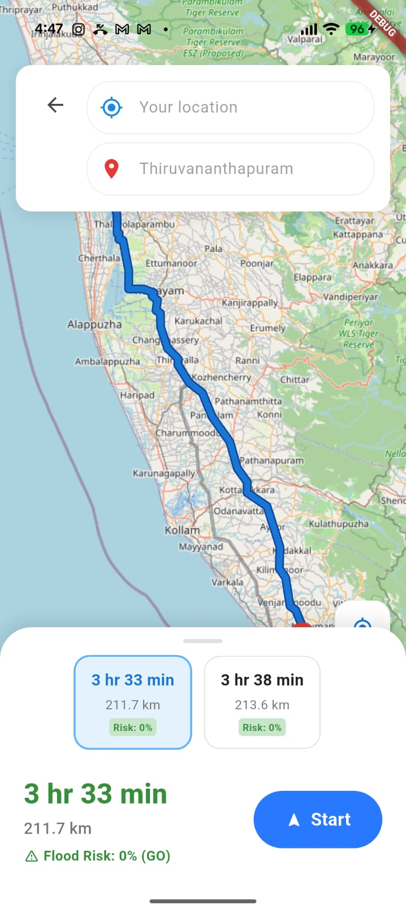
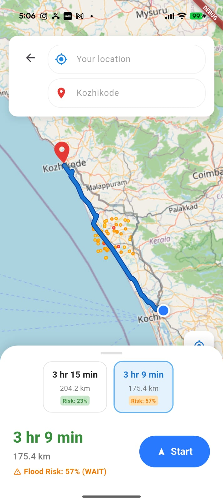
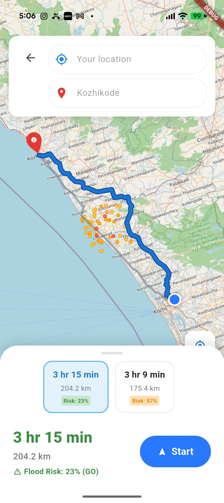

# FLOODRIX

### Predict. Protect. Deliver.

> AI-powered flood prediction and resilient logistics routing for Kerala.





FLOODRIX is an intelligent logistics decision-support platform designed to predict the probability of flooding along a vehicle's route and use that prediction to make safer, more reliable logistics decisions.

Instead of simply showing historically flood-prone areas, FLOODRIX learns from **historical flood events and the environmental conditions under which flooding occurred**. It combines this learned knowledge with current and forecast weather conditions to estimate the probability of flooding at specific locations along a planned or ongoing route.

The predicted flood risk is then combined with logistics information such as route geometry, estimated arrival time, cargo type, delivery deadlines, and road closures to recommend the safest practical route.

---

## 🚨 Problem

Kerala's transportation network is frequently affected by:

- Flooding
- Waterlogging
- Heavy rainfall
- Landslides
- Road closures
- Traffic disruptions
- Delivery delays

For logistics operators, the problem is not simply knowing that an area is historically flood-prone.

The real question is:

> **"Will this particular road be affected by flooding when my vehicle reaches it?"**

Traditional navigation systems primarily optimize for distance and travel time. FLOODRIX introduces **predicted flood risk as a routing factor**.

---

# 💡 Core Concept

FLOODRIX is built around a historical-event-driven flood prediction pipeline.

```text
Historical Flood Events
          +
Historical Weather Conditions
          +
Flood-Prone Areas
          +
Terrain / Geographic Factors
          ↓
   Machine Learning Model
          ↓
  Flood Probability Model
          ↓
Current + Forecast Weather
          ↓
Flood Probability Along Route
          ↓
Logistics Risk Engine
          ↓
GO / REROUTE / WAIT
```

---

## 📊 Dataset & Machine Learning Logic

FLOODRIX utilizes a robust Machine Learning pipeline powered by a Random Forest Classifier trained on historical flood events in Kerala. 

### Features Used:
- **`rainfall_1h`**, **`rainfall_6h`**, **`rainfall_24h`**: Cumulative rainfall distributions over preceding hours.
- **`elevation`**: Height above sea level (m) to calculate runoff and vulnerability.
- **`historical_flood_frequency`**: Base weight of how often a given area floods historically.
- **`flood_zone`**: Encoded terrain categorization (low, medium, high, extreme risk zones).

### The Logic Pipeline:
1. **Route Generation**: The app sends origin and destination coordinates to the Open Source Routing Machine (OSRM).
2. **Waypoints Extraction**: The resulting route geometry is sliced into 1km geographical road segments.
3. **Live Weather Ingestion**: Each segment fetches live coordinate-specific rainfall data.
4. **Risk Inference**: The trained ML model predicts the continuous flood probability `[0.0 to 1.0]` for every individual segment.
5. **Route Aggregation**: The highest risk segment along a route dictates the route's overall Max Risk Probability.
6. **Decision Engine**: 
   - `Risk < 40%` ➡️ **GO**
   - `40% <= Risk < 80%` ➡️ **REROUTE**
   - `Risk >= 80%` ➡️ **WAIT**

---

## 🔑 APIs & Services Used

To run FLOODRIX locally, you will need the following APIs running. The App utilizes public services by default so you do not need proprietary API keys.

1. **Open-Meteo API** (No Key Required)
   - Used for fetching hyper-local historical and live weather/rainfall data based on coordinate queries.
2. **Open Source Routing Machine (OSRM)** (No Key Required)
   - Used to generate the base route geometries, distance calculations, and ETAs.
3. **Nominatim OpenStreetMap (OSM)** (No Key Required)
   - Used for forward and reverse geocoding (searching for locations by name).
4. **FlutterMap & OSM Tiles**
   - Used to render the map visuals on the frontend without relying on paid Google Maps APIs.

### Backend Setup:
Make sure your `.env` file in the root matches the open-source APIs:
```env
MAP_TILE_URL=https://tile.openstreetmap.org/{z}/{x}/{y}.png
NOMINATIM_BASE_URL=https://nominatim.openstreetmap.org
OSRM_BASE_URL=https://router.project-osrm.org
```
